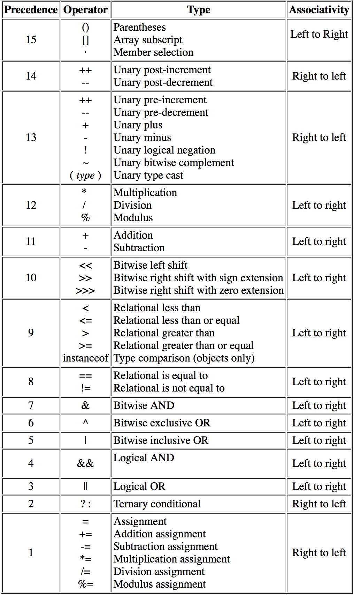

# COMP 150 Lab 2 - Java Fundamentals

In this lab, you will learn:

* The structure of a basic program in Java.
* What a comment is, and how to comment in Java.
* How to name variables, constants, classes, ...
* How to stored and manipulate data in a variable.
* What "declaration" and "assignment" are, how to declare and assign value to variables and constants in Java.
* How to create and store data in a constant.
* The difference between variables and constants.
* How to access a variable's value.
* The eight primitive data types in Java, and what data they store.
* What a `String` is, and how to create one in Java.
* What literal values are, and how to format primitive literals and `String` literals.
* How to perform basic arithmetic operations in Java.
* How to import a library / package.
* How to use methods from the `Math` library.
* How to use the `Scanner` class from `java.util` to get input from the console.
* What "operator precedence" means and how to determine the order in which operations will occur in Java.
* What typecasting is, and how to convert between the primitive number types in Java.
* Shortcut operators.

There are discussion questions throughout the reading below. The answers are included at end of the lab, and are linked to the questions. Try to answer the questions before reading their answers! You are encouraged to discuss them (and anything else in this lab) with your neighbors.

## Part 1 - Java Program Structure

Any Java program consists of at least one **class**. The program we will discuss and create today will be comprised of exactly one class. We'll spend more time covering exactly what a class is and how classes interact in future labs.

Each class has a **name**, also known as an **identifier**; we'll go over what qualities identifiers must have to be valid later in this lab.

Each class also has a **body**, denoted with a set of curly braces `{}`. Everything inside the curly braces is part of the class, and is said to be in the **scope** of the class.

Below is a class whose identifier is `MyClass` and whose body is empty.

```java
class MyClass
{
	
}
```

Every Java program has exactly one **main method**. If a program consists of multiple classes, only one of those classes should contain a main method.

Any main method consists of the header `public static void main(String[] args)`, followed by curly braces `{}`. The contents of the curly braces are the **body** of the main method. `main` is an identifier reserved for the main method. `public`, `static`, and `void` are all keywords in Java, and we will discuss their individual uses and meanings in future labs. We will also discuss the meaning of `String[] args` in a future lab.

When a program is executed, execution starts inside the body of the main method.

Below is the simplest possible program in Java. If defines a class called `MyClass` whose contents consist exclusively of a main method with an empty body.

<a name="q1"></a>**[QUESTION 1](#a1)** : What does the program below do when run?

```java
class MyClass
{
	public static void main(String[] args)
	{
	
	}
}
```

## Comments

Often you'll want to add **comments** to your code to explain how it functions, what its purpose is, etc. A comment is plain text that is ignored by the compiler, so it does not affect how the program runs.

Comments in Java come in two varieties: single-line comments and multi-line comments. Single line comments start with `//` and span a single line. Anything that appears after a `//` on a line is **commented out**, so it will be ignored by the compiler.

Multi-line comments can span multiple lines; they begin with `/*` and end with `*/`.

Usually, when you make a new class, you should include comments at the start of the file explaining what the class is for or what it does.

The two snippets below are identicaly in functionality; in the first, the program description is in several single-line comments and in the second it is in one multi-line comment.

```java
// The class MyClass below
// does absolutely nothing.

class MyClass
{
	public static void main(String[] args)
	{
	
	}
}
```

```java
/*
	The class MyClass below
	does absolutely nothing.
*/

class MyClass
{
	public static void main(String[] args)
	{
	
	}
}
```

You'll often also want to include comments alongside small parts of your program indicating what those parts do.

```java
class MyClass
{
	public static void main(String[] args)
	{
		// declare an int variable called myInteger
		int myInteger;
		
		// assign the value 1 to myInteger
		myInteger = 1;
	}
}
```

<a name="q2"></a>**[QUESTION 2](#a2)**: Two programs are identical, except that one contains comments and the other program doesn't. Both programs are compiled. Is there any difference between the compiled versions of the programs?

<a name="q3"></a>**[QUESTION 3](#a3)**: Do comments affect the performance (e.g. speed) of a program?

## Identifiers

### Properties

An **identifier** is essentially a name for a variable, constant, method, class... basically anything that you create will need a name by which you can refer to it in your code.

In Java, an identifier must have the following properties:

* Starts with a **Java letter**:
	* `A-Z`
	* `a-z`
	* `_`
	* `$`
* Can contain any number of Java letters and digits `0-9`
* Cannot contain spaces
* Cannot be keywords (words reserved by Java, like `int` and `class`)

Java identifiers are **case sensitive**. `number1` and `Number1` are different identifiers!

<a name="q4"></a>**[QUESTION 4](#a4)** Determine whether each of the following is a single valid identifiers in Java; if not, determine why not.

1. `asdf`
2. `ASDF`
3. `aSDf`
4. `as df`
5. `$asdf`
6. `myvariable`
7. `for`
8. `var1`
9. `1var`

### Conventions

It is generally wise to choose an identifier that describes the thing being named; your identifiers should try to describe he purpose of the object being named, or describe the data that will be stored in it. Nondescriptive variable names are generally frowned upon, as they make code harder to read and therefore harder to edit and improve. Choosing good identifiers can reduce the need for comments explaining code by making the code itself readable enough to not require as much commenting!

It is helpful to categorize identifiers and systematically name members of different categories, so an identifier is enough to determine what type of data is referred to.

There are many conventions for choosing identifiers. One common convention is:

* Class identifiers are in `PascalCase`, meaning each word in the identfier starts with a capital and the rest is lowercase. The class called `MyClass` in the example above is named using `PascalCase`
* Variables are named in `camelCase`, which is the same as `PascalCase` but the first word starts with a lower case. The variable `myInteger` in the example above is named using `camelCase`.
* Constants are named in `UPPER_SNAKE_CASE`; every word in the identifier is caps locked, with underscores separating the words.

The naming conventions you use will vary from project to project. In industry, most teams have an agreed upon coding style used by everyone on the team in order to facilitate collaboration. It is not important what system you choose for identifier selection, **as long as you are systematic and consistent**. That is, it doesn't matter which system you choose as long as you choose and stick to a system.

The setup above leaves `lower_snake_case` available, so if another type of identifier is added into the mix, it can be written in this style.

## Declaration and Assignment

### Variables

Variables are created and named with a **declaration**. A variable declaration specifies:

* What type of data the variable will refer to.
* The identifier for the variable.

```java
int myNumber;
```

The declaration above declares a variable called `myNumber` of type `int`. This means `myNumber` can hold the value of an integer.

Notice that no value is given to `myNumber` in the statement above. The variable is set up, and ready to store an integer value, but value has been **assigned** to it. The first assignment to a variable is said to **initialize** the variable. Variables that have not been initialized (also known as **uninitialized variables**) cannot be **accessed** (i.e. their values cannot be used). Code which attempts to access a variable that has been declared but not initialized will not compile. For example:

```java
class MyClass
{
    public static void main(String[] args)
    {   
        int x;
        System.out.println("x's value is : " + x);
    }
}
```

The code above will not compile. This is because `x` is declared with the statement `int x;`, but is never initialized. The next line `System.out.println("x's value is : ", + x);` would attempt to access `x` to print its value.

Compilation will fail even if the variable **might** not have been initialized. For instance, the code below gets an input from the user. If that input is `0`, it assigns value `1` to `x`; otherwise it does not perform this assignment, so `x` is left uninitialized. Because `x` might be left uninitialized, the code will not even compile.

```java
import java.util.Scanner;

class MyClass
{
    public static void main(String[] args)
    {
        Scanner scan = new Scanner(System.in);

        int x;

        System.out.print("Enter an integer : ");
        int userInput = scan.nextInt();
        
        if (userInput == 0)
        {
            x = 1;
        }
        System.out.println("hello " + x);
    }
}
```

A declared variable can be made to hold a specfied value with an **assignment**; this is done with `=`, the **assignment operator**. A statement which uses the assignment operator to assign a value to a variable is called an **assignment statement**.

```java
// declare myNumber
int myNumber;

// assign value 1 to myNumber;
myNumber = 1;
```

Variables can be **reassigned** whenever desired; that is, their values can be changed to a new value at any time. Variables can **never** be **redeclared**. Once a variable has been declared, it cannot be declared again. 

<a name="q5"></a>**[QUESTION 5](#a5)**: Read the program below, and see if  you can determine what it does. What is printed? Try running it and see if you were correct.

```java
class MyClass
{
	public static void main(String[] args)
	{
		// declare myNumber
		int myNumber;
		
		// assign value 1 to myNumber and print it
		myNumber = 1;
		System.out.println("My number is : " myNumber);
		
		// reassign myNumber's value to 2, and print it
		myNumber = 2;
		System.out.println("My number is : " myNumber);
	}
}	
```

A variable can be declared and assigned on the same line:

```java
// declare myVariable, assign its value to 1
int myVariable = 1;
```

### Constants

A **constant** is similar to a variable, but it has one key difference: a constant's value can only be assigned once, and after this assignment its value cannot change.

Declaring a constant is similar to declaring a variable, but the constant declaration has an extra keyword, `final`, which denotes that any value assigned to the constant is final (i.e. it cannot be changed).

```java
// declare a constant int
final int MY_CONSTANT;

// set its value permanently
MY_CONSTANT = 1;
```

Note another difference: the identifier `MY_CONSTANT` has been spelled using a different capitalization scheme than the `myVariable`. This is a **choice**; the capitalization scheme used for identifiers does not affect what the referenced variables, constants, classes etc can do. To reiterate from the previous section, identifiers should be formatted systematically based on what they reference.

<a name="q6"></a>**[QUESTION 6](#a6)**: If you try to compile the following program, what happens?

```java
class MyClass
{
	public static void main(String[] args)
	{
		final int MY_CONSTANT = 1;
		
		MY_CONSTANT = 2;
	}
}
```

## Accessing Primitive Data

When primitive data has been stored in a variable or constant, it generally has been saved with the intention to **access** the data later. Otherwise, why store it to begin with?

Whenever the identifier of a variable or constant is used (except on the left side of an assignment statement) it is used as a reference to the value stored in the variable.

In the snippet below, `x` is initially assigned the value `2` and then `y` is assigned the **value** of `x`. This does not mean that `x` and `y` are the same variable; `y` has been given a **copy** of `x`'s value. The use of `x` anywhere other than as the left side of an assignment statement (`x = ...`) accesses `x`'s stored data (i.e. `x`'s value).

```java
class MyClass
{
	public static void main(String[] args)
	{
		int x = 2;
		int y = x;
	}
}
```

<a name="q7"></a>**[QUESTION 7](#a7)**: In the snippet below, what is printed out as the value of `y` at the bottom? Since `y` was declared and initialized with `int y = x;`, does changing `x`'s value also change `y`'s value?

```java
class MyClass
{
	public static void main(String[] args)
	{
		int x = 2;
		int y = x;
		
		x = 3;
		
		System.out.println("x's value is : " + x);
		System.out.println("y's value is : " + y);
	}
}
```

## Java's Primitive Data Types

Java has eight built-in, basic data types called **primitives**. These are not the only data types in Java - new data types can be defined at will (we will make our own data types later in the semester through class definitions). But any data that is not primitive data can is comprised of primitive data; all data types are constructed out of the primitive data types. Primitives are to data types as primes are to natural numbers.

Four of Java's eight primitive data types are for storing integer numbers:

* `byte` :
	* integer data, stored in 8 bits (1 byte)
	* minimum value: `-128`
	* maximum value: `127`
* `short` :
	* integer data, stored in 16 bits (2 bytes)
	* minimum value: `-32768`
	* maximum value: `32767`
* `int` :
	* integer data, stored in 32 bits (4 bytes)
	* minimum value: `-2147483648`
	* maximum value: `2147483647`
* `long` :
	* integer data, stored in 64 bits (8 bytes)
	* minimum value : `-9223372036854775808`
	* maximum value : `9223372036854775807`

These integer data types can also `unsigned`, meaning they do not have a bit denoting whether they're positive or negative and are assumed to be non-negative. As a tradeoff for the loss of the ability to encode negative numbers, the maximum values double.

For instance, an `unsigned byte` variable would use 8 bits (1 byte) just like a `byte` variable, but the `unsigned byte` would have a minimum value of `0` and a maximum value of `255`.

Two of the remaining four primitive data types are numberical. They are not for storing integer data, but for storing **floating point** data, i.e. (positive or negative) numbers with non-whole parts. These two data types are:

* `float` :
	* floating point data, stored in 32 bits (4 bytes)
	* minimum positive value: `1.4E-45`
	* maximum positive value: `3.4028235E38`
* `double` :
	* floating point data, stored in 64 bits (8 bytes)
	* minimum positive value: `4.9E-324`
	* maximum positive value: `1.7976931348622157E308`

There are two remaining primitive data types:

* `char` :
	* character data, stored in 16 bits (2 bytes)
	* stores a single character
* `boolean` :
	* stores either `true` or `false`, these are the only possible values

<a name="q8"></a>**[QUESTION 8](#a8)**: Imagine you want to store integer data in a variable. Imagine further that based on the context, you know that:

* The value of the integer will never be negative.
* The value of the integer will always be at most `40000`.

What primitive data type should you use to store the data?

## The `String` Data Type

A `String` is a sequence of characters. For instance, `"abc 123"` could be a `String` composed of the sequence of characters `'a'`, `'b'`, `'c'`, `' '`, `'1'`, `'2'`, `'3'`.

`String`s are not a primitive data type in Java; they are instead objects. In fact, all data types in Java other than the eight primitives discussed earlier are objects. We will discuss the differences between objects and primitives shortly.

## Literal Values

Literal values are sequences of characters which represent values for different data types.

### Integer Literals

For example, `int`, `short` and `byte` literals are all an optional `+` or `-` sign followed by a a collection of digits. This should be somewhat intuitive; literal values for these three data types, meant to store integer values, are characters which represent integer values.

Consider for example the three statements below:

```java
byte a = 1;
short b = -1;
int c = +5;
```

Each statement does two things:

* Declares a variable (of type `byte`, `short` or `int`)
* Assigns value to the variable, using a literal value

`long` literals are similar to `byte`, `short` and `int` literals but they have an extra piece: a trailing `l` (that is a lowercase `L`, for `long`). So, while `12` is a `byte`, `short` or `int` literal, `12l` is a `long` literal.

```java
long d = 25l;
```

In general, these integer literals are encoded in base `10`. But different encodings can be used if desired.

Integer literals (`byte`, `short`, `int` and `long` literals, that is) that start with `0` are treated as **octal** integers, meaning the value of the literal is read in base `8`.

Integer literals that start with `0x` are **hexadecimal** literals, encoded in base `16` (using the digits `0-9` and then the letters `a-f`).

You don't need to understand how these other ways to write integer literals work right now, but if you're curious you can read up on octal values [here](https://en.wikipedia.org/wiki/Octal) and hexedecimal values [here](https://simple.wikipedia.org/wiki/Hexadecimal).

### Floating Point Literals

Floating point literals are like integer literals, but they include a decimal point. They are formatted as follows:

`float` : an optional `+` or `-` sign, followed by a decimal number with a trailing `f`

`double`: an optional `+` or `-` sign, followed by a decimal number

Literals for both floating point types can be given in either fixed or scientific notation. The `double` literal `122.3` (in fixed notation) is identical to a scientific notation equvialent `1.223e2` (which means `1.223` times `10` raised to the power `2`).

<a name="q9"></a>**[QUESTION 9](#a9)** : What are the `float` literal equivalents of the `double` literals `122.3` and `1.223e2`?

The following declarations and assignments would all be valid:

```java
double a = 122.3;
double b = 1.223e2;
float c = 122.3f;
float d = 1.223e2f;
```

### Boolean Literals

Literal values for `boolean` prititives are very simple. `boolean` data is either `true` or `false`. These are the only possible literal values for `boolean`s.

```java
boolean firstBool = true;
boolean secondBool = false;
```

### Character Literals

`char` data is represented with an individual character in single quotes. For example, the character `a` would be represented with literal `'a'`.

Here are a few sample declarations and assignments for `char` variables:

```java
char theFirstLetter = 'a';
char theNextLetter = 'b';
```

### String Literals

`String` literal data is represented as a sequence of 0 or more characters in double quotes. If you wanted to store the word "pancake" in a `String` variable, you would do it using the literal `"pancake"`.

A string with 0 characters, called an 

For example, the following statement declares a variable named `pancakeString` of type `String` and stores in it the sequence of characters `"pancake"`.

```java
String pancakeString = "pancake";
```


## Arithmetic Operators

The five basic arithmetic operations in Java are `+`, `-`, `*`, `/`, and `%`. They are used for addition, subtraction, multiplication, division and remainder respectively. If `x` and `y` are both primitive numerical variables or constants of the same type (the numberical primitives are `byte`, `short`, `int`, `long`, `float`, and `double`) then:

* `x + y` is the sum of `x` plus `y`
* `x - y` is the difference, `x` minus `y`
* `x * y` is the product of `x` times `y`
* `x / y` is the quotient of `x` divided by `y`
* `x % y` is the remainder of `x` divided by `y`

The order in which arithmetic operations are executed can be determined the same way it is in mathematics, using **PEMDAS** (if you're not sure what **PEMDAS** is, use those search engine skills). You may have noticed that exponentiation does not have an operator; it is done with a **method** from the `Math` library, which we will discuss later.

<a name="q10"></a>

## "Shortcut" Operators

<a name="q11"></a>

## Types, Assignment, Conversion and Casting

<a name="q12"></a>

## Operator Precedence

There are **many** operators in Java in addition to the arithmetic ones (and some arithmetic ones that we haven't discussed yet). The order in which operators' operations are carried out is determined using Java's operator precedence, which is shown in the table below. The operators at the top of the table are carried out first, and those at the bottom, last. It is not necessary for you to understand what most of the operators below are, for now.

]

<a name="q13"></a>

## Answers to Discussion Questions

### <a name="a1"></a>**[QUESTION 1](#q1)** 

The short answer is "Nothing", in that nothing appears to happen from the user perspective when running the program. The longer answer is that, as stated above, a class called `MyClass` is defined, so a small amount of memory is set aside and the class definition is written in that memory, but these are all functions that happen under the hood in Java. Feel free to check out [this lab](https://github.com/arewhyaeenn/COMP_232_LAB_1_2_C_TUTORIAL) (for sophomore level students) if you want to learn a bit about memory allocation in C (as well as the basics if C).

### <a name="a2"></a>**[QUESTION 2](#q2)**

No, there is no difference between the two compiled programs; comments are ignored by the compiler. There are even tools called reverse compilers which take compiled code and convert back to Java; if you take a Java program with comments, compile it and then reverse-compile the result, you'll get your original program without the comments.

### <a name="a3"></a>**[QUESTION 3](#q3)**

Because comments are ignored by the compiler, they **do not** affect the performance of the program. They can make the program take (infinitesimally) more time to compile, but in general run time matters and compile time does not matter because a program only needs to be compiled once and then the compiled program can be used as many times as desired.

### <a name="a4"></a>**[QUESTION 4](#q4)**

1. Yes, `asdf` is a valid identifier.
2. Yes, `ASDF` is a valid identifier.
3. Yes, `aSDf` is a valid identifier.
4. No, `as df` is not a valid identifier, identifiers cannot contain spaces.
5. Yes, `$asdf` is a valid identifier, `$` is a Java letter.
6. Yes, `myvariable` is a valid identifier, but something more readable like `myVariable` or `MY_VARIABLE` would be better.
7. No, `for` is not a valid identifier because `for` is a keyword in Java (but we haven't talked about this particular keyword yet, so that wasn't a very fair question).
8. Yes, `var1` is a valid identifier, identifiers can contain digits.
9. No, `1var` is not a valid identifier; while identifiers can contain digits, they must start with a Java letter.

### <a name="a5"></a>**[QUESTION 5](#q5)**

The program does precisely what the comments state it does: it declared an `int` variable called `myNumber`, assigns `myNumber`'s value to `1`, prints that value `1`, reassigns `myNumber`'s value to `2`, and then prints this new value `2`.

### <a name="a6"></a>**[QUESTION 6](#q6)**

The program does not compile. The value of constant data (data declared with the `final` keyword) cannot be changed.

### <a name="a7"></a>**[QUESTION 7](#q7)**

`y`'s value is still `2` at the end. When `y` is initialized with `int y = x;`, it is given the same value as `x` (`2`). When `x`'s value then changes to `3`, `y`'s does not change with it because `y` contained a copy of `x`'s data at the time of assignment, not a reference to `x` itself.

### <a name="a8"></a>**[QUESTION 8](#q8)**

The variable should be stored using an `unsigned short`. A `byte` is not large enough (even an `unsigned byte` has a maximum value of `255`). A `short`'s maximum value is `32767`, which is not quite large enough for the maximum stored value of `40000`. An `unsigned short`, however, can go up to `65535`. That is, an `unsigned short` can store any positive integer less than `2` raised to the `16`'th power, because it has `16` bits. There is no reason to use an `int` instead, as the `int` uses more space (`32` bits) and an `unsigned short` is large enough to meet the requirements.

### <a name="a9"></a>**[QUESTION 9](#q9)**

`float` literals are written the same as `double` literals, but with a trailing `f`. The `float` equivalent of `122.3` is `122.3f`. The `float` equivalent of `1.223e2` is `1.223e2f`.

